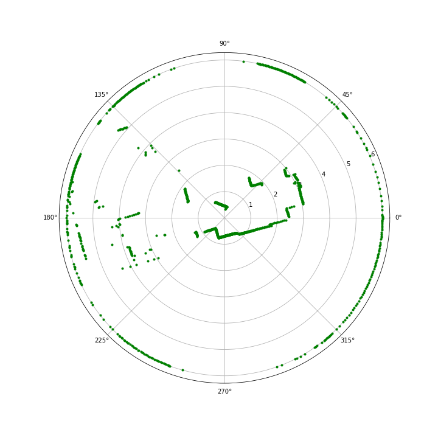

# LiDAR Noise Filtering

Scripts developed in order to filter noise in [LaserScans](http://docs.ros.org/en/noetic/api/sensor_msgs/html/msg/LaserScan.html), gathered by TALOS's LiDAR sensors. 

## Topics

LiDAR Noise Filtering scripts subscribe to `/scan_multi` and publish to `/filtered_scans`

## Messages 

All messages types are [sensor_msgs/LaserScan](http://docs.ros.org/en/api/sensor_msgs/html/msg/LaserScan.html) with the following definition:
```
float32 angle_min
float32 angle_max
float32 angle_increment
float32 time_increment
float32 scan_time
float32 range_min
float32 range_max
float32[] ranges
float32[] intensities
```
## Range Filter

Common practice in the following scripts is using a `Range Filter` before applying their core filter. We apply this practice in order to focus on close proximity noise which creates most of our problems. `Range Filter` replaces values that are below min or above max with None. It returns the filtered scan and the indices of the not None values. An example is being displayed below:

 
